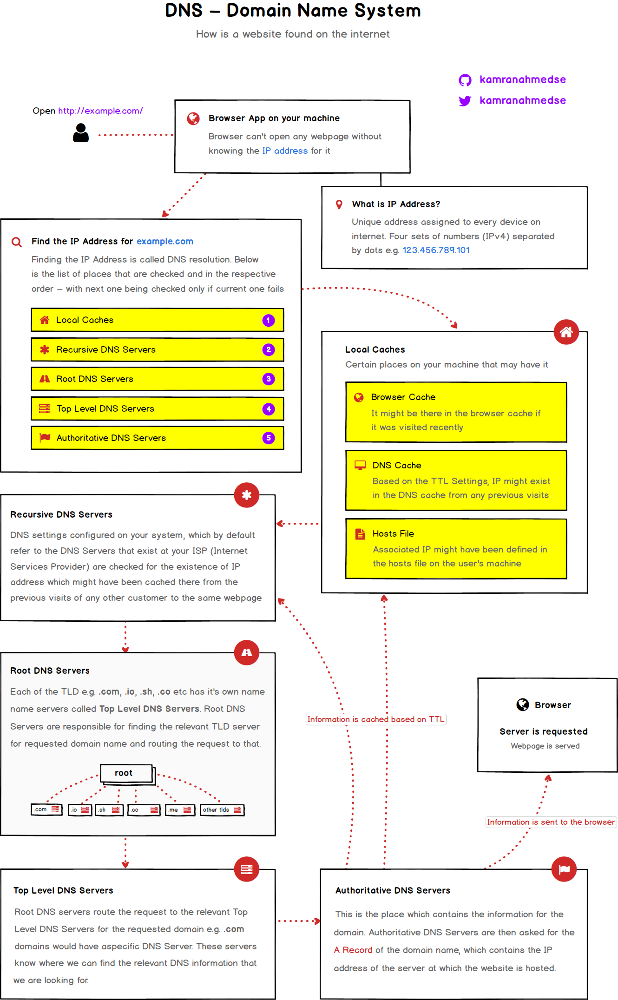
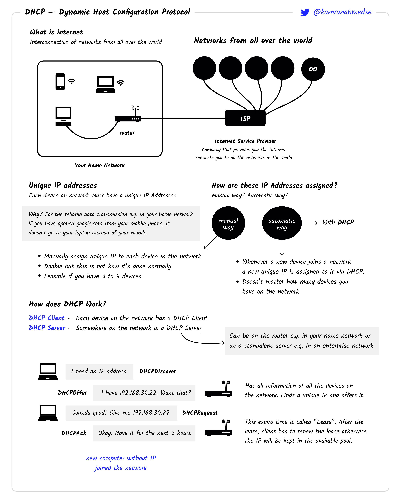

##  🚀 Day 76 Challenge: Start Learning 🚀

Today, let's delve into DNS and DHCP. Understanding these is fundamental for aspiring developers because they govern how devices connect and communicate on networks.

## Contents
1. [DNS](#dns)
2. [DHCP](#dhcp)

## DNS

The Domain Name System (DNS) acts as the Internet's phone book, translating human-friendly domain names like `example.com` into IP addresses like `192.0.2.1` that computers use to identify each other on the network. For instance, when you type `www.google.com` into your browser, DNS resolves this into the IP address of Google's server, enabling your browser to load the website.

### DNS In One Picture

## DHCP

Dynamic Host Configuration Protocol (DHCP) automatically assigns IP addresses to devices on a network, ensuring they can communicate with each other. For example, when you connect your smartphone to a Wi-Fi network, DHCP assigns it an IP address so it can access the internet without manual configuration.

### DHCP In One Picture

## References

- [What is DNS?](https://roadmap.sh/guides/dns-in-one-picture)
- [What is DHCP?](https://roadmap.sh/guides/dhcp-in-one-picture)
---
