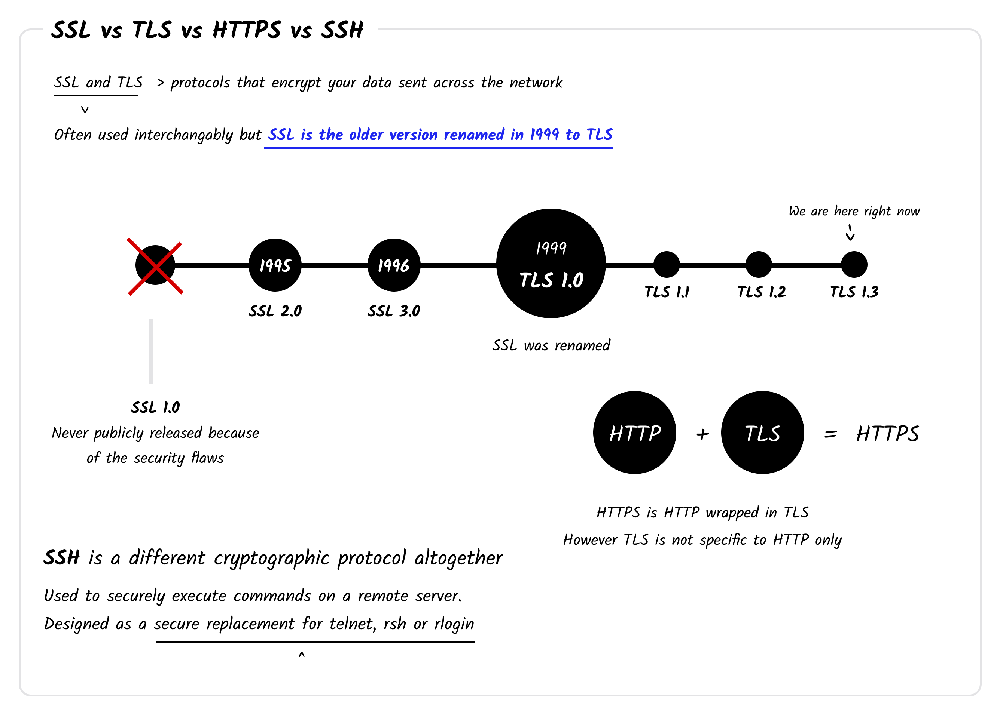

##  🚀 Day 77 Challenge: Start Learning 🚀

## SSL vs TLS VS SSH

SSL (Secure Sockets Layer) and TLS (Transport Layer Security) are ways to make sure that when you send something over the internet, it stays safe. TLS is basically an updated and more secure version of SSL. They both work to keep your data safe while it's traveling from one place to another, like when you're checking your email or shopping online.

SSH (Secure Shell) is another way to keep things safe online. It's like a special door that lets you securely talk to another computer over the internet. So, while SSL and TLS keep your information safe while it's moving, SSH helps you talk securely to another computer.

## References
- [SSL vs TLS VS SSH](https://roadmap.sh/guides/ssl-tls-https-ssh)
---
