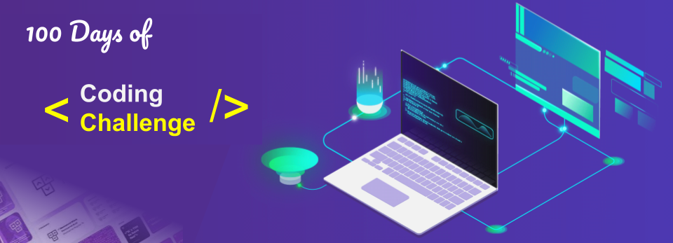

<!-- Add your own banner here -->

  

<!-- Your introduction section -->
# Welcome to the 100 Days of Coding Challenge! 🚀

## Introduction

Hey there! Are you ready to embark on an epic journey of coding and learning? If yes, buckle up because the 100 Days of Coding Challenge awaits you!

## 🎯 Challenge Objective

The mission is clear: dedicate a slice of your daily life to mastering the art of coding over the next 100 days. By the end of this adventure, you'll wield the power of languages like JavaScript and TypeScript with confidence.

## 📚 What You Will Become?

Picture this: You, a coding wizard! By the end of this challenge, you'll transform into a developer at the beginner to advanced level. Think of it as your magical journey from "Hello, World!" to crafting complex applications.

## 📖 How to Approach This Challenge

1. **Understand the Topic**: Begin each day by diving into the assigned concept or topic.
2. **Code Daily**: Let your fingers dance on the keyboard as you bring your newfound knowledge to life.
3. **Review and Reflect**: Wrap up your day by reflecting on your learnings and envisioning how they fit into real-world scenarios.
4. **Engage with the Community**: Join us on Discord to mingle with other learners, share your progress, and seek guidance.
5. **Stay Consistent**: Just like a superhero hones their powers, make learning a habit and witness your skills soar!

## 🤝 Join the Community

Step into our vibrant Discord community! It's not just about coding; it's about connecting, collaborating, and cheering each other on. Let's build a supportive tribe together!

## 📝 Daily Log

Capture your victories, big and small, in your daily log. Share your triumphs with the world and inspire your fellow coders to keep pushing forward!

## 💪 Let's Get Started!

Are you psyched to kick off this 100-day coding odyssey? Remember, it's not just about the destination; it's about the exhilarating journey of growth and discovery. Let's dive in and make magic happen!

### 📅 Start Date: [02/03/2024]

*Happy Coding, and I'll see you at the finish line!* 🏁

**#100DaysOfCode #CodeToLearn #LearningJourney**
